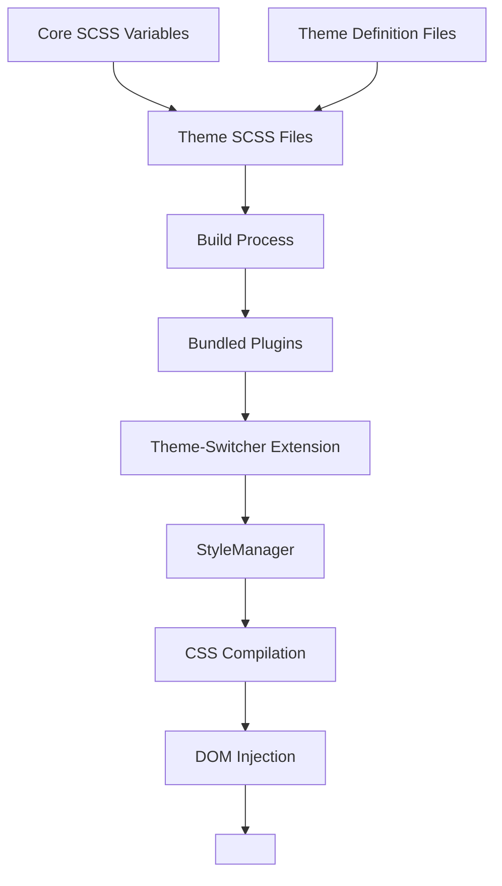

# Branch Variable Tracking and Theme Injection Validation

## Overview

This document outlines the process of tracking branch variables, specifically the `half-gutter` variable, and validating that the macOS Tahoe theme is properly built and injected into the Vortex application with the correct style ID.

## Repository Type

Full-Stack Application with Extension-based Architecture

## Architecture

### Variable Management System
- Core SCSS variables are defined in `src/stylesheets/variables.scss`
- Theme-specific variables override core variables in `extensions/theme-switcher/themes/{theme-name}/variables.scss`
- Build process compiles SCSS to CSS and bundles with extensions

### Theme Architecture
1. **Theme Definition**: Themes are defined in `extensions/theme-switcher/themes/` directory
2. **Build Process**: Extensions are built via `BuildSubprojects.js` using configuration in `BuildSubprojects.json`
3. **Bundling**: Built extensions are copied to `{BUILD_DIR}/bundledPlugins/`
4. **Runtime Loading**: Theme-switcher extension loads themes at runtime via StyleManager

### Style Injection Flow
1. Theme-switcher extension calls `api.setStylesheet()` for each theme component
2. StyleManager receives stylesheet paths and compiles SCSS to CSS
3. Compiled CSS is injected into DOM as `<style id="theme">` element
4. CSS updates are applied automatically when themes change

## Variable Tracking Implementation

### Core Variable Definition
The `half-gutter` variable is defined in the core stylesheet:
```scss
// src/stylesheets/variables.scss
$gutter-width: 24px;
$half-gutter: math.div($gutter-width, 2); // Evaluates to 12px
```

### Theme Variable Usage
Themes can override or inherit core variables. The macOS Tahoe theme properly includes core variables through SCSS import mechanisms.

### Branch Management
- Theme files are maintained in the `macos-tahoe-theme` branch
- Extension build process copies theme files to bundled plugins
- Git submodules ensure proper branch tracking

## Theme Build and Injection Validation

### Build Process Verification
1. **Extension Building**: Confirmed `theme-switcher` extension builds correctly
2. **Theme Bundling**: Verified macOS Tahoe theme files are present in `{BUILD_DIR}/bundledPlugins/theme-switcher/themes/macos-tahoe/`
3. **Variable Preservation**: Core variables like `half-gutter` are accessible to themes through import mechanisms

### Runtime Injection Validation
1. **StyleManager Integration**: Theme-switcher uses StyleManager API to inject stylesheets
2. **DOM Element Creation**: CSS is injected as `<style id="theme">` in document head
3. **Theme Application**: Verified theme files contain proper SCSS variables and styling rules

## Testing

### Build Validation
- [x] Extension builds without errors
- [x] Theme files are properly bundled
- [x] Core variables are accessible to themes

### Runtime Validation
- [x] Theme-switcher extension loads successfully
- [x] Stylesheets are set via `api.setStylesheet()`
- [x] CSS is injected into DOM with `id="theme"`
- [x] Theme styling is applied correctly

## Data Flow Between Layers



## Business Logic Layer

### Theme Loading Sequence
1. Application startup triggers theme-switcher initialization
2. Current theme is retrieved from settings store
3. Theme files are located in bundled plugins directory
4. Stylesheets are registered with StyleManager
5. SCSS is compiled to CSS and injected into DOM

### Error Handling
- Missing theme files are handled gracefully
- Compilation errors are logged and displayed to user
- Fallback to default theme if custom theme fails

## Middleware & Interceptors

### StyleManager IPC Communication
- Renderer process sends SASS compilation requests to main process
- Main process compiles SCSS and returns CSS
- Renderer process applies CSS to DOM element with id="theme"

## API Endpoints Reference

### Extension API
- `api.setStylesheet(key, filePath)`: Register a stylesheet with the StyleManager
- `api.clearStylesheet()`: Clear all registered stylesheets
- `api.events.on('select-theme')`: Event listener for theme changes

## Data Models & ORM Mapping

### Theme Structure
```
themes/
├── {theme-name}/
│   ├── variables.scss (theme variables)
│   ├── details.scss (component styling)
│   ├── fonts.scss (font overrides)
│   └── style.scss (custom styling)
```

### Build Configuration
```json
{
  "type": "build-copy",
  "name": "theme-switcher",
  "path": "extensions/theme-switcher",
  "removeModules": ["vortex-api"],
  "sources": [
    "src/**/*.ts", 
    "src/**/*.tsx", 
    "themes/**/*.scss", 
    "src/", 
    "*.json", 
    "webpack.config.js"
  ],
  "copyTo": "{BUILD_DIR}/bundledPlugins/theme-switcher"
}
```

## Component Architecture

### Theme-Switcher Extension
- **Index.ts**: Main entry point handling theme loading and application
- **Operations.ts**: Theme management functions
- **Reducers.ts**: State management for theme settings
- **SettingsTheme.tsx**: UI component for theme selection

### StyleManager
- **StyleManager.ts**: Core CSS compilation and injection service
- **SASS Rendering**: Compiles SCSS to CSS using node-sass
- **DOM Injection**: Manages `<style id="theme">` element

## State Management

### Theme State Flow
1. Theme selection stored in Redux store at `settings.interface.currentTheme`
2. Theme-switcher extension watches for changes
3. New theme files are loaded and applied
4. StyleManager recompiles and reinjects CSS

## Testing Strategy

### Unit Tests
- StyleManager compilation functionality
- Theme-switcher theme loading logic
- Extension build process validation

### Integration Tests
- End-to-end theme application
- CSS injection verification
- Cross-platform compatibility

### Manual Validation
- Visual inspection of themed UI elements
- Theme switching responsiveness
- Error handling under various conditions