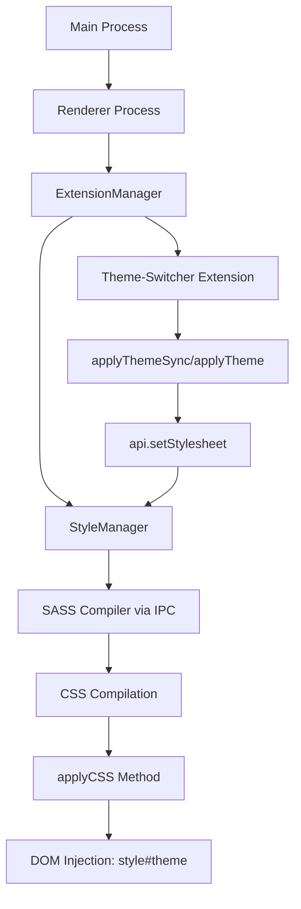

# Vortex Mac Port: Theme Injection Analysis and Solution Design

## Overview

Vortex is a complex Electron-based mod manager with a sophisticated theming system that dynamically compiles SCSS stylesheets and injects them into the application DOM. The core issue is a **timing race condition** where theme stylesheets are not being properly injected into the `<head>` element with `id="theme"` during application launch on macOS.

This document provides a comprehensive analysis of the theme injection architecture and presents solutions to ensure reliable theme loading during startup.

## Architecture Analysis

### Core Components



### Application Startup Sequence

The application follows this initialization order:

1. **Main Process** (`main.ts`)
   - Electron app initialization
   - Creates main window
   - Sets up IPC channels

2. **Renderer Process** (`renderer.tsx`)
   - Extension manager creation
   - Redux store initialization
   - Extension loading (`extensions.doOnce()`)
   - **Theme application** (`applyThemeSync` in `context.once()`)
   - Language setup
   - **Style rendering** (`extensions.renderStyle()`)
   - UI rendering

3. **StyleManager Initialization**
   - Created during ExtensionManager setup
   - Initially `mAutoRefresh = false`
   - Activated via `startAutoUpdate()` during `renderStyle()`

### Theme-Switcher Extension Flow

The theme-switcher extension has two critical functions:

#### `applyThemeSync()` - Synchronous Theme Application
```typescript
function applyThemeSync(api: types.IExtensionApi, theme: string): void {
  const themeDir = path.join(__dirname, 'themes', theme);
  
  // Set stylesheet paths immediately
  api.setStylesheet('variables', path.join(themeDir, 'variables'));
  api.setStylesheet('details', path.join(themeDir, 'details'));
  api.setStylesheet('fonts', path.join(themeDir, 'fonts'));
  api.setStylesheet('style', path.join(themeDir, 'style'));
}
```

#### StyleManager.setSheet() Behavior
- **Before `startAutoUpdate()`**: Changes are queued but **not rendered**
- **After `startAutoUpdate()`**: Changes trigger automatic rendering

### The Race Condition Problem

The issue occurs in this sequence:

1. **Extension Loading Phase** (`context.once()`)
   - `applyThemeSync()` is called
   - `StyleManager.setSheet()` updates partials
   - **No rendering occurs** (auto-refresh disabled)

2. **Style Rendering Phase** (`extensions.renderStyle()`)
   - `StyleManager.startAutoUpdate()` enables auto-refresh
   - `StyleManager.renderNow()` compiles current partials
   - **Theme partials may not be set yet** due to timing

3. **Result**: CSS compilation happens before theme paths are applied

## Current Implementation Details

### StyleManager.setSheet() Implementation
```typescript
public setSheet(key: string, filePath: string): void {
  // Updates mPartials array
  this.mPartials[idx] = { key, file: filePath };
  
  // Only renders if auto-refresh is enabled
  if (this.mAutoRefresh) {
    this.mRenderDebouncer.schedule(undefined);
  }
}
```

### CSS Injection Process
```typescript
private applyCSS(css: string) {
  const style = document.createElement('style');
  style.id = 'theme';
  style.type = 'text/css';
  style.innerHTML = css;
  
  const head = document.getElementsByTagName('head')[0];
  let found = false;
  
  // Replace existing theme element or append new one
  for (let i = 0; i < head.children.length && !found; ++i) {
    if (head.children.item(i).id === 'theme') {
      head.replaceChild(style, head.children.item(i));
      found = true;
    }
  }
  if (!found) {
    head.appendChild(style);
  }
}
```

## Root Cause Analysis

### Timing Issues

1. **Extension Order Dependency**: Theme-switcher runs in `context.once()` but StyleManager rendering happens later
2. **Auto-Refresh Timing**: StyleManager doesn't auto-render until after `startAutoUpdate()` is called
3. **Async Extension Loading**: Extensions load asynchronously, creating unpredictable timing

### Platform-Specific Factors

1. **macOS File System Performance**: Slower file I/O may affect SCSS compilation timing
2. **Electron Process Communication**: IPC latency between main and renderer processes
3. **SASS Compilation**: Native module performance differences on macOS

## Solution Architecture

### Approach 1: Immediate Rendering (Recommended)

Modify `applyThemeSync()` to force immediate rendering:

```typescript
function applyThemeSync(api: types.IExtensionApi, theme: string): void {
  log('debug', 'applyThemeSync called', { theme });
  
  if (theme === null) {
    // Clear stylesheets
    return;
  }

  const themeDir = path.join(__dirname, 'themes', theme);
  
  // Set all stylesheet paths
  api.setStylesheet('variables', path.join(themeDir, 'variables'));
  api.setStylesheet('details', path.join(themeDir, 'details'));
  api.setStylesheet('fonts', path.join(themeDir, 'fonts'));
  api.setStylesheet('style', path.join(themeDir, 'style'));
  
  // Force immediate rendering during initialization
  if (api.renderStyleNow) {
    api.renderStyleNow().catch(err => {
      log('warn', 'Failed to render theme during initialization', err.message);
    });
  }
}
```

### Approach 2: Deferred Theme Application

Delay theme application until StyleManager is ready:

```typescript
context.once(() => {
  const currentTheme = store.getState().settings.interface.currentTheme;
  
  // Schedule theme application after StyleManager initialization
  context.api.events.on('style-manager-ready', () => {
    if (currentTheme) {
      applyTheme(context.api, currentTheme, true);
    }
  });
});
```

### Approach 3: Enhanced Startup Synchronization

Implement proper synchronization between extension loading and style rendering:

```typescript
// In renderer.tsx
.then(() => extensions.doOnce())
.then(() => {
  // Ensure theme is applied before style rendering
  const currentTheme = store.getState().settings.interface.currentTheme;
  if (currentTheme) {
    return applyThemeImmediate(extensions.getApi(), currentTheme);
  }
})
.then(() => extensions.renderStyle())
```

## Implementation Requirements

### StyleManager Enhancements

1. **Add `renderStyleNow()` to API**:
```typescript
// In ExtensionManager.ts
renderStyleNow: () => this.mStyleManager.renderNow(),
```

2. **Improve Logging**:
```typescript
private applyCSS(css: string) {
  log('debug', 'StyleManager applyCSS - injecting CSS', {
    cssLength: css?.length || 0,
    cssPreview: css?.substring(0, 200) || 'empty',
    timestamp: new Date().toISOString()
  });
  
  // ... existing implementation ...
  
  // Verification
  const injectedElement = document.getElementById('theme');
  log('info', 'CSS injection result', {
    success: !!injectedElement,
    contentLength: injectedElement?.innerHTML?.length || 0,
    timestamp: new Date().toISOString()
  });
}
```

### Theme-Switcher Modifications

1. **Synchronous Initial Application**:
```typescript
function applyThemeSync(api: types.IExtensionApi, theme: string): void {
  // Set theme paths
  setThemePaths(api, theme);
  
  // Force immediate compilation and injection
  return forceThemeRender(api).catch(err => {
    log('warn', 'Initial theme render failed, will retry during normal cycle', err.message);
  });
}
```

2. **Robust Error Handling**:
```typescript
function setThemePaths(api: types.IExtensionApi, theme: string): void {
  try {
    const themeDir = path.join(__dirname, 'themes', theme);
    
    ['variables', 'details', 'fonts', 'style'].forEach(type => {
      const filePath = path.join(themeDir, type);
      api.setStylesheet(type, filePath);
      log('debug', 'Theme stylesheet path set', { type, filePath });
    });
  } catch (err) {
    log('error', 'Failed to set theme paths', { theme, error: err.message });
    throw err;
  }
}
```

## Testing Strategy

### Verification Methods

1. **DOM Inspection**:
```javascript
// Check for theme element
const themeElement = document.getElementById('theme');
console.log('Theme element exists:', !!themeElement);
console.log('CSS content length:', themeElement?.innerHTML?.length || 0);
```

2. **Startup Logging**:
```bash
yarn start --user-data=/tmp/vortex-temp-logs
```

3. **Theme Switching Test**:
```typescript
// Programmatic theme switching
api.events.emit('select-theme', 'macos-tahoe');
```

### Debug Scenarios

1. **Empty Theme Element**: CSS compilation failed or never triggered
2. **Missing Theme Element**: DOM injection failed completely  
3. **Incorrect CSS Content**: Wrong theme files compiled
4. **Timing Logs**: Analyze sequence of events during startup

## Performance Considerations

### SCSS Compilation Optimization

1. **Caching Strategy**: StyleManager already implements CSS caching
2. **Incremental Compilation**: Only recompile when theme files change
3. **Async Processing**: Use non-blocking compilation where possible

### Memory Management

1. **Debounced Rendering**: Prevent excessive re-compilation during rapid changes
2. **Cache Cleanup**: Clear old CSS cache entries
3. **Resource Cleanup**: Properly dispose of DOM elements

## Monitoring and Diagnostics

### Critical Log Points

1. **Theme Extension Loading**:
```typescript
log('info', 'Theme-switcher extension initialized', {
  currentTheme: store.getState().settings.interface.currentTheme,
  timestamp: new Date().toISOString()
});
```

2. **StyleManager Operations**:
```typescript
log('debug', 'StyleManager renderNow triggered', {
  partials: this.mPartials.length,
  autoRefresh: this.mAutoRefresh,
  timestamp: new Date().toISOString()
});
```

3. **CSS Injection Verification**:
```typescript
log('info', 'CSS injection verification', {
  themeElementExists: !!document.getElementById('theme'),
  cssLength: document.getElementById('theme')?.innerHTML?.length || 0,
  timestamp: new Date().toISOString()
});
```

### Runtime Verification

Add runtime checks to verify theme injection:

```typescript
// In renderer.tsx startup sequence
setTimeout(() => {
  const themeElement = document.getElementById('theme');
  if (!themeElement || !themeElement.innerHTML) {
    log('error', 'Theme injection verification FAILED', {
      elementExists: !!themeElement,
      hasContent: !!(themeElement?.innerHTML),
      retry: true
    });
    
    // Retry theme application
    const currentTheme = store.getState().settings.interface.currentTheme;
    if (currentTheme) {
      extensions.getApi().events.emit('apply-theme', currentTheme);
    }
  } else {
    log('info', 'Theme injection verification SUCCESS', {
      cssLength: themeElement.innerHTML.length
    });
  }
}, 1000); // Check after UI is fully loaded
```

## Risk Assessment

### High Risk Areas

1. **Breaking Existing Functionality**: Changes to core styling system
2. **Performance Impact**: Additional rendering calls during startup
3. **Cross-Platform Compatibility**: Ensuring Windows compatibility is maintained

### Mitigation Strategies

1. **Incremental Deployment**: Test changes on macOS first
2. **Fallback Mechanisms**: Retry logic for failed theme applications
3. **Comprehensive Logging**: Detailed diagnostics for troubleshooting
4. **User Notification**: Alert users if theme loading fails

## Conclusion

The theme injection issue in Vortex Mac port is primarily caused by a timing race condition between theme-switcher extension initialization and StyleManager rendering. The recommended solution involves modifying the `applyThemeSync()` function to force immediate rendering during startup, combined with enhanced error handling and verification mechanisms.

This approach ensures reliable theme loading while maintaining the existing architecture and providing robust fallback mechanisms for edge cases.