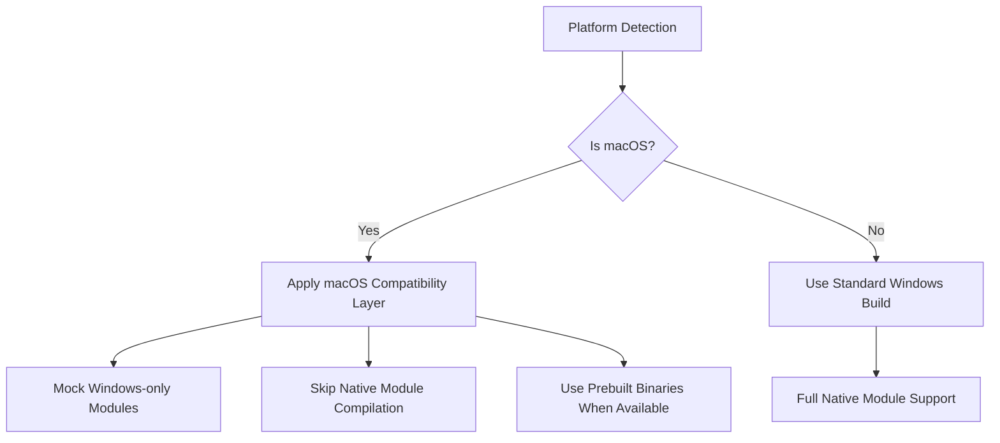
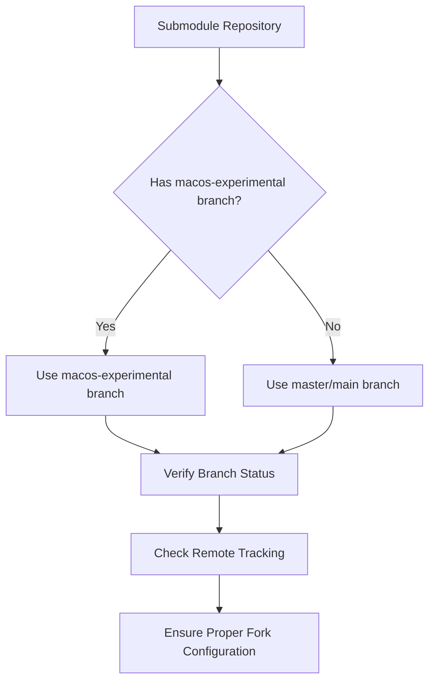
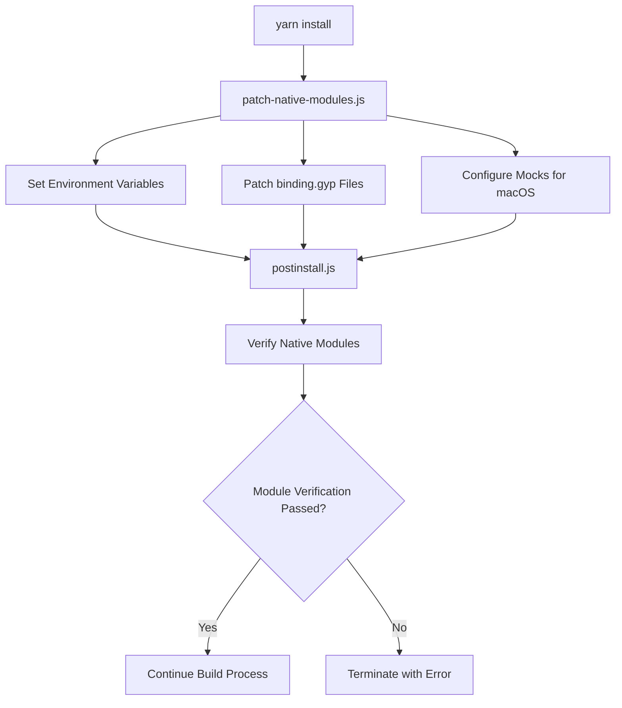

# Vortex Project Clean Install Validation Design

## Overview

This document outlines the design for ensuring that the Vortex mod manager project and all its submodules can be installed, built, and run from a fresh clean install without any errors or warnings. The design addresses cross-platform compatibility issues, particularly focusing on macOS support while maintaining Windows functionality.

## Architecture

### System Components

1. **Core Application**
   - Electron-based desktop application
   - TypeScript/React/Redux frontend
   - Node.js backend with native modules

2. **Extension System**
   - 50+ modular extensions for game support
   - Git submodules for version control
   - Platform-specific build conditions

3. **Native Module Handling**
   - C++ native modules with prebuild support
   - Platform-specific mocking system
   - Conditional compilation and build skipping

4. **Build System**
   - Yarn package manager (v1.22.19)
   - Webpack for bundling
   - Custom build scripts for extensions

### Platform Support Strategy



## Native Module Validation

### Module Categorization

| Module Category | Examples | macOS Strategy |
|-----------------|----------|----------------|
| Core Modules | vortexmt, xxhash-addon | Patch binding.gyp for C++ exceptions |
| Windows-Only | drivelist, diskusage, winapi-bindings | Use mock implementations |
| Cross-Platform | leveldown, ref, ffi | Use prebuilt binaries or mocks |
| Optional | bsdiff-node, node-7z | Skip if compilation fails |

### Mock Implementation Pattern

```javascript
// Mock pattern for Windows-only modules
module.exports = {
  // Shell operations
  ShellExecuteEx: () => {
    // No-op or platform-appropriate implementation
  },
  
  // Registry operations (Windows-specific)
  RegGetValue: () => {
    // Return mock data or platform equivalent
    return { type: 'REG_SZ', value: 'mock-value' };
  },
  
  // File system operations with cross-platform handling
  GetVolumePathName: (filePath) => {
    if (process.platform === 'darwin') {
      // macOS implementation
      return path.parse(filePath).root || '/';
    }
    // Default implementation
    return path.dirname(filePath);
  }
};
```

### Environment Configuration

Set environment variables to control native module behavior:

```bash
# Skip native builds
export SKIP_NATIVE_BUILD=1
export PREBUILD_INSTALL_ONLY=1
export npm_config_build_from_source=false

# Module-specific overrides
export YARN_MODULENAME_skip_build=true
export YARN_MODULENAME_prebuild=false
export YARN_MODULENAME_build_from_source=false
```

## Submodule Validation

### Submodule Branch Strategy



### Submodule Validation Process

1. **Branch Verification**
   - Check all submodules are on correct branches
   - Validate remote tracking information
   - Ensure no detached HEAD states

2. **Platform-Specific Handling**
   - Identify Windows-only extensions from BuildSubprojects.json
   - Skip building Windows-only extensions on macOS
   - Build cross-platform extensions normally

3. **Build Condition Evaluation**
   - Parse condition fields in BuildSubprojects.json
   - Skip modules with `process.platform === 'win32'` on macOS
   - Build modules with no conditions or `process.platform !== 'win32'`

## Build Process Validation

### Installation Phase



### Build Phase

1. **Core Application Build**
   ```bash
   # Build API
   cd api && yarn run build
   
   # Compile themes
   sass --style compressed src/stylesheets/style.scss > out/assets/css/style.css
   
   # Build main application
   yarn run build_rest
   tsc -p .
   ```

2. **Extension Build Process**
   ```bash
   # Build extensions based on conditions
   node BuildSubprojects.js out
   
   # For app distribution
   node BuildSubprojects.js app
   ```

3. **Conditional Build Skipping**
   - Evaluate `condition` field in BuildSubprojects.json
   - Skip modules with `process.platform === 'win32'` on macOS
   - Log skipped modules with appropriate messaging

### Distribution Phase

1. **Webpack Bundling**
   ```bash
   webpack --config webpack.main.config.js
   webpack --config webpack.renderer.config.js
   ```

2. **Electron Packaging**
   ```bash
   electron-builder --config electron-builder-config.json
   ```

## Error Handling and Validation

### Native Module Validation

1. **Pre-flight Checks**
   - Verify all required mock files exist in `__mocks__` directory
   - Check environment variables are properly set
   - Validate node-addon-api configuration

2. **Runtime Validation**
   - Verify native modules can be loaded
   - Test critical functionality of mocked modules
   - Provide graceful degradation when modules fail

### Build Validation

1. **Success Criteria**
   - All non-skipped modules build successfully
   - No compilation errors or warnings
   - All required files are generated in correct locations

2. **Failure Handling**
   - Clear error messages for failed modules
   - Retry mechanism for intermittent failures
   - Detailed logging for troubleshooting

### Cross-Platform Compatibility

1. **Platform Detection**
   ```javascript
   function isWindows() {
     return process.platform === 'win32';
   }
   
   function isMacOS() {
     return process.platform === 'darwin';
   }
   ```

2. **Conditional Logic**
   - Use platform detection in build scripts
   - Apply appropriate mocks based on platform
   - Skip incompatible operations

## Testing Strategy

### Installation Testing

1. **Fresh Install Validation**
   - Clean working directory
   - No node_modules or build artifacts
   - Complete installation from scratch

2. **Dependency Resolution**
   - Verify all dependencies install correctly
   - Check for missing or conflicting packages
   - Validate optional dependencies handling

### Build Testing

1. **Build Completeness**
   - Verify all expected output files are generated
   - Check bundled plugin structure
   - Validate asset compilation

2. **Platform-Specific Testing**
   - Test Windows build on Windows
   - Test macOS build on macOS
   - Verify cross-platform compatibility

### Runtime Testing

1. **Application Launch**
   - Successful Electron application start
   - Core modules load without errors
   - UI renders correctly

2. **Extension Functionality**
   - Verify non-platform-specific extensions work
   - Test mocked module functionality
   - Check extension loading and registration

## Implementation Plan

### Phase 1: Environment Setup

1. Configure environment variables for native module handling
2. Implement platform detection utilities
3. Set up mock infrastructure

### Phase 2: Native Module Handling

1. Update patch-native-modules.js for macOS compatibility
2. Verify all required mocks exist
3. Implement graceful fallbacks

### Phase 3: Build System Updates

1. Modify BuildSubprojects.js for better platform handling
2. Update condition evaluation logic
3. Improve skip messaging

### Phase 4: Validation and Testing

1. Create clean install test procedure
2. Implement validation scripts
3. Document troubleshooting procedures