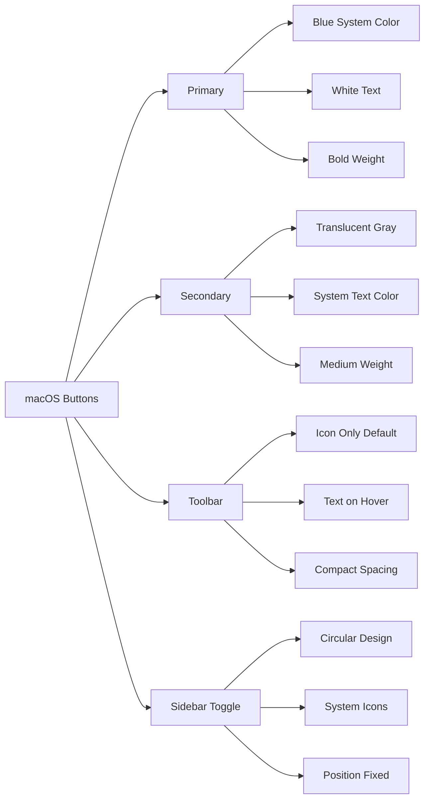
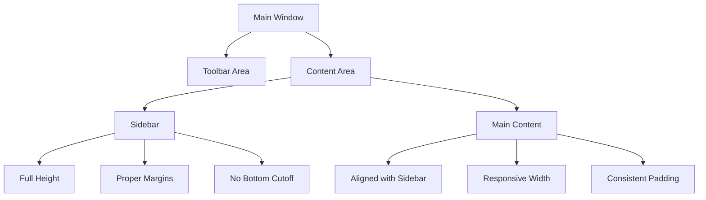

# Mac-like Theme Update Design

## Overview

This design document outlines the comprehensive update to the existing macOS Tahoe theme to achieve a more authentic macOS appearance. The update focuses on implementing compact toolbar design, native macOS button styling, proper system fonts with correct sizing and kerning, removing Windows-specific controls, and fixing sidebar layout alignment issues.

## Architecture

### Current State Analysis

The existing macOS Tahoe theme (`extensions/theme-switcher/themes/macos-tahoe/`) implements:
- Basic macOS color palette and typography
- Translucent materials with backdrop filters
- Custom sidebar styling with liquid glass effects
- Partial toolbar customization

### Target Architecture

```mermaid
graph TD
    A[macOS Tahoe Theme] --> B[Compact Toolbar Base]
    A --> C[Native Button System]
    A --> D[System Font Implementation]
    A --> E[Window Controls Management]
    A --> F[Layout Alignment System]
    
    B --> B1[Compact Theme Integration]
    B --> B2[Reduced Toolbar Height]
    B --> B3[Icon-first Approach]
    
    C --> C1[macOS Button Styles]
    C --> C2[Focus Ring Implementation]
    C --> C3[Hover Animations]
    
    D --> D1[San Francisco Font Stack]
    D --> D2[Proper Font Weights]
    D --> D3[Letter Spacing Optimization]
    
    E --> E1[Windows Controls Removal]
    E --> E2[macOS Traffic Light Space]
    E --> E3[Titlebar Region Adjustment]
    
    F --> F1[Sidebar Position Fix]
    F --> F2[Content Area Alignment]
    F --> F3[Bottom Cutoff Resolution]
```



## Core Requirements

### 1. Compact Toolbar Implementation

**Base Theme Integration**
- Inherit compact theme's toolbar behavior
- Implement icon-only toolbar with text on hover
- Reduce toolbar height to 32px
- Apply macOS styling to compact structure

**Implementation Strategy**
```scss
// Import compact theme toolbar behaviors
@import '../compact/style.scss';

// Override with macOS styling
.mainpage-header {
  height: 32px;
  background: rgba(50, 50, 50, 0.85);
  backdrop-filter: blur(20px) saturate(180%);
  border: none;
  border-radius: 6px;
}
```

### 2. Native macOS Button System

**Button Design Specifications**
- Rounded corners with 6px border-radius
- Translucent background with backdrop blur
- Native macOS shadow and highlight effects
- Proper focus ring implementation
- Smooth hover and active state transitions

**Button Hierarchy**


### 3. System Font Implementation

**Font Stack Configuration**
```scss
$theme-font-family-base: -apple-system, BlinkMacSystemFont, 
  'SF Pro Display', 'SF Pro Text', 'Helvetica Neue', 
  Helvetica, Arial, sans-serif;

// Font sizes matching macOS interface guidelines
$font-size-base: 13px;        // Standard interface
$font-size-large: 15px;       // Titles and headers
$font-size-small: 11px;       // Labels and captions
$font-size-xs: 10px;          // Fine print

// Font weights following Apple's design system
$font-weight-light: 300;
$font-weight-regular: 400;
$font-weight-medium: 500;
$font-weight-semibold: 600;
$font-weight-bold: 700;

// Letter spacing for optimal readability
$letter-spacing-base: -0.003em;
$letter-spacing-headings: -0.005em;
$letter-spacing-labels: 0.0em;
```

**Typography Optimization**
- Enable font feature settings for ligatures and kerning
- Apply -webkit-font-smoothing: antialiased
- Implement proper line heights for different text sizes
- Ensure consistent font rendering across components

### 4. Window Controls Management

**Windows Controls Removal**
- Detect and hide Windows-specific window controls
- Remove maximize, minimize, close buttons for Windows
- Preserve macOS traffic light positioning space
- Adjust toolbar margin to accommodate traffic lights

**Implementation Approach**
```scss
// Hide Windows controls on macOS
#window-controls {
  display: none !important;
}

// Adjust toolbar for traffic lights
#main-toolbar {
  margin-left: 80px; // Space for traffic lights
  padding-top: 8px;   // Additional top spacing
}

// Remove Windows titlebar drag region
.toolbar-app-region {
  -webkit-app-region: none;
}
```

### 5. Layout Alignment System

**Sidebar Alignment Issues**
- Current: Sidebar is cut off at bottom and misaligned
- Target: Full height sidebar with proper content alignment
- Solution: Fix flex layout and positioning

**Layout Structure**


**Alignment Fixes**
- Remove fixed positioning from sidebar
- Implement proper flex layout with stretch alignment
- Fix height calculations to prevent bottom cutoff
- Ensure content area aligns with sidebar boundaries

## Component Integration

### Toolbar Component Updates

**Compact Base Integration**
```scss
// Inherit compact toolbar structure
@import '../compact/style.scss';

// macOS-specific overrides
.mainpage-header {
  background: $translucent-toolbar;
  backdrop-filter: $backdrop-filter;
  border-radius: $border-radius-medium;
  box-shadow: 0 2px 8px rgba(0, 0, 0, 0.15),
              inset 0 1px 0 rgba(255, 255, 255, 0.1);
}

.mainpage-header .btn {
  border-radius: $border-radius-small;
  font-weight: $font-weight-medium;
  transition: all $transition-fast;
  
  &:hover {
    background: rgba(255, 255, 255, 0.15);
    transform: translateY(-1px);
    box-shadow: 0 2px 8px rgba(0, 0, 0, 0.2);
  }
}
```

### Button System Implementation

**Primary Buttons**
```scss
.btn-primary {
  background: $primary-color;
  border: 1px solid $primary-color;
  border-radius: $border-radius-medium;
  color: white;
  font-weight: $font-weight-semibold;
  
  &:hover {
    background: darken($primary-color, 5%);
    transform: translateY(-1px);
    box-shadow: 0 4px 12px rgba(0, 122, 255, 0.3);
  }
  
  &:focus {
    outline: none;
    box-shadow: 0 0 0 2px $focus-ring-color;
  }
}
```

**Secondary Buttons**
```scss
.btn-secondary {
  background: rgba(255, 255, 255, 0.1);
  border: 1px solid rgba(255, 255, 255, 0.2);
  border-radius: $border-radius-medium;
  color: $text-color;
  font-weight: $font-weight-medium;
  backdrop-filter: blur(10px);
  
  &:hover {
    background: rgba(255, 255, 255, 0.2);
    border-color: rgba(255, 255, 255, 0.3);
  }
}
```

### Sidebar Enhancement

**Positioning and Layout**
```scss
#main-nav-sidebar {
  position: relative; // Remove fixed positioning
  background: $translucent-sidebar;
  backdrop-filter: $backdrop-filter;
  border-radius: $border-radius-large;
  height: 100%; // Full container height
  min-height: calc(100vh - 100px); // Prevent cutoff
  
  // Proper flex integration
  display: flex;
  flex-direction: column;
  
  &.sidebar-compact {
    width: $sidebar-width-compact;
  }
  
  &.sidebar-expanded {
    width: $sidebar-width-expanded;
  }
}
```

## Implementation Plan

### Phase 1: Foundation Setup
1. Create enhanced variables.scss with complete macOS design tokens
2. Implement system font stack with proper weights and spacing
3. Set up button system base classes and mixins
4. Configure layout foundation with flex improvements

### Phase 2: Compact Integration
1. Import and extend compact theme toolbar behavior
2. Apply macOS styling to compact toolbar structure  
3. Implement icon-first approach with hover text reveals
4. Adjust toolbar height and spacing for macOS aesthetics

### Phase 3: Button System
1. Implement primary, secondary, and toolbar button styles
2. Add focus ring system matching macOS guidelines
3. Create hover and active state animations
4. Apply button styling across all UI components

### Phase 4: Layout Fixes
1. Remove Windows window controls and adjust spacing
2. Fix sidebar positioning and height calculations
3. Align content areas with sidebar boundaries
4. Test responsive behavior and edge cases

### Phase 5: Polish and Refinement
1. Fine-tune typography spacing and weights
2. Optimize animation timing and easing curves
3. Ensure consistent theming across all components
4. Validate accessibility and usability

## Technical Considerations

### Performance Optimization
- Minimize use of backdrop-filter for better performance
- Implement efficient CSS animations with hardware acceleration
- Use CSS custom properties for dynamic theming values
- Optimize selector specificity to prevent style conflicts

### Cross-Platform Compatibility
- Maintain fallbacks for non-macOS platforms
- Ensure theme degrades gracefully without backdrop-filter support
- Test layout behavior across different screen resolutions
- Validate font rendering on various display types

### Accessibility Requirements
- Implement proper focus management for keyboard navigation
- Ensure sufficient color contrast ratios
- Maintain readable text sizes and spacing
- Provide clear visual feedback for interactive elements

## Testing Strategy

### Visual Validation
- Compare theme appearance with native macOS applications
- Test toolbar compact behavior and icon visibility
- Validate button interactions and animations
- Check sidebar alignment and content flow

### Functional Testing
- Verify theme switching works correctly
- Test responsive behavior during window resizing
- Validate keyboard navigation and focus management
- Check performance with various content loads

### Cross-Component Integration
- Test theme consistency across all Vortex interfaces
- Validate extension compatibility with updated theme
- Check mod management interfaces for proper styling
- Ensure settings panels maintain theme coherence