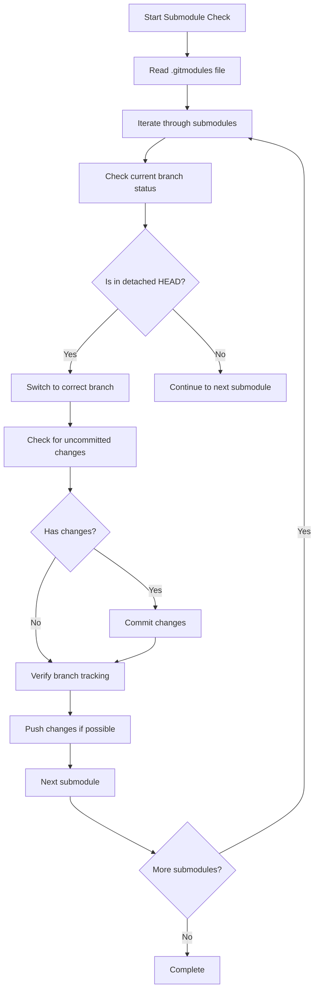

# Submodule Branch Check and File System Migration Design

## Overview

This document outlines the design for:
1. Ensuring all Git submodules are on the correct branch with no detached HEAD states
2. Replacing all uses of the `glob` module with native Node.js `fs` operations
3. Providing a comprehensive validation script to ensure the project and all submodules install, build, and run correctly after a refresh

## Component Design

### 1. Submodule Branch Checker Script

This script will check all Git submodules to ensure they are on the correct branch and not in a detached HEAD state.

#### Key Functions

- `checkSubmoduleBranches()` - Iterate through all submodules and verify branch status
- `fixDetachedHead(submodule)` - Switch detached HEAD submodules to appropriate branches
- `commitChanges(submodule)` - Commit any untracked changes to the appropriate branch
- `pushChanges(submodule)` - Push committed changes to remote repositories

#### Workflow



#### Branch Strategy

- All submodules should be on their configured branch (typically `master` or `main`)
- For macOS development, submodules with changes should be on `macos-experimental` branches
- Submodules in detached HEAD state will be switched to the appropriate branch

### 2. File System Migration Utility

This utility will replace all uses of the `glob` module with native Node.js `fs` operations for better cross-platform compatibility and performance.

#### Key Functions

- `findFiles(dir, pattern)` - Recursively find files matching a pattern using native fs
- `matchPattern(filePath, pattern)` - Check if a file path matches a glob pattern
- `convertGlobToRegex(pattern)` - Convert glob patterns to regular expressions
- `walkDirectory(dir, callback)` - Walk directory tree with callback for each file

#### Migration Strategy

The migration will replace:
- `glob(pattern, options, callback)` → `findFiles(dir, pattern)`
- `glob.sync(pattern, options)` → `findFiles(dir, pattern)`

#### Pattern Matching Implementation

```javascript
function globToRegex(pattern) {
  // Escape special regex characters
  const escapedPattern = pattern
    .replace(/[.+^${}()|[\]\\]/g, '\\$&')
    .replace(/\?/g, '.')
    .replace(/\*\*/g, '.*')
    .replace(/\*/g, '[^/]*');
  
  return new RegExp(`^${escapedPattern}$`);
}
```

### 3. Validation Script

A comprehensive validation script will ensure the project and all submodules install, build, and run correctly after the changes.

#### Validation Steps

1. Verify project directory structure
2. Clean previous builds (node_modules, out, app/node_modules)
3. Install dependencies with yarn
4. Ensure TypeScript types are properly installed
5. Build the API
6. Build the main application
7. Build extensions
8. Compile themes
9. Verify build output files
10. Verify bundled plugins
11. Validate platform-specific handling

#### Cross-Platform Handling

- On macOS: Verify mock modules are used for Windows-only native modules
- On Windows: Verify native modules are properly compiled
- Handle file system differences (path separators, case sensitivity)

## Data Models

### Submodule Status Model

```typescript
interface SubmoduleStatus {
  path: string;
  url: string;
  branch: string;
  currentBranch: string;
  detachedHead: boolean;
  hasUncommittedChanges: boolean;
  trackingBranch: string;
}
```

### File Pattern Model

```typescript
interface FilePattern {
  pattern: string;
  basePath: string;
  recursive: boolean;
  extensions: string[];
}
```

## Testing Strategy

### Unit Tests

- Test parsing of `.gitmodules` file
- Test detection of detached HEAD states
- Test branch switching functionality
- Test change detection and commit logic
- Test glob pattern to regex conversion
- Test file pattern matching
- Test directory walking functionality
- Test recursive file finding
- Test directory existence checks
- Test file existence checks
- Test command execution functionality
- Test platform detection

### Integration Tests

- End-to-end submodule branch validation
- Complete file system migration workflow
- Full project validation after changes

## Implementation Approach

### Submodule Branch Checker

1. Create script to read `.gitmodules` file
2. Implement branch status checking for all submodules
3. Add functionality to fix detached HEAD states
4. Implement change detection and commit logic
5. Add push functionality with proper error handling

### File System Migration

1. Identify all files using the `glob` module
2. Create native fs equivalents for all glob operations
3. Replace glob usage with native fs operations
4. Test pattern matching equivalence
5. Verify performance improvements

### Validation Script

1. Create comprehensive validation script
2. Implement cross-platform compatibility checks
3. Add detailed error reporting
4. Test on both Windows and macOS
5. Document usage and troubleshooting

## Security Considerations

1. Ensure proper permissions when pushing submodule changes
2. Validate all file paths to prevent directory traversal attacks
3. Sanitize all input to command execution functions
4. Handle git operations with appropriate credentials

## Performance Considerations

1. Use asynchronous operations where possible
2. Implement efficient directory walking algorithms
3. Cache frequently accessed file system information
4. Minimize redundant file system operations

## Error Handling

1. Graceful handling of git operation failures
2. Proper error messages for missing permissions
3. Retry logic for transient file system errors
4. Detailed logging for troubleshooting

## Dependencies

- Node.js built-in `fs` module
- Node.js built-in `path` module
- Node.js built-in `child_process` module
- Git command-line tools
- Yarn package manager

## Future Enhancements

1. Add support for automatic submodule forking when push permissions are missing
2. Implement more sophisticated pattern matching for complex glob patterns
3. Add parallel processing for improved performance
4. Create a GUI interface for easier submodule management