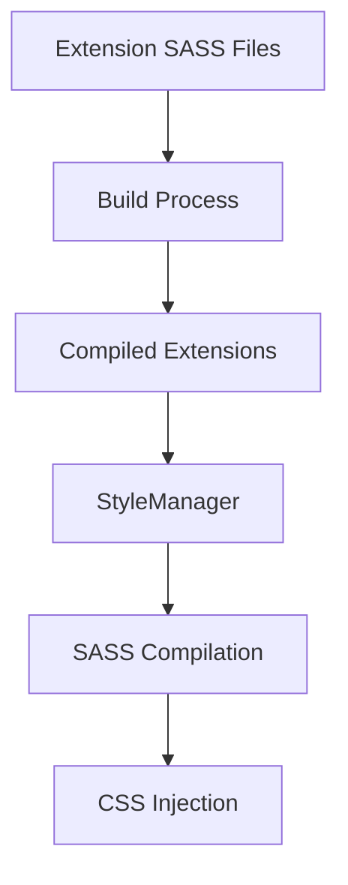

# Theme Compilation Error Analysis and Solution

## Overview

This document analyzes a SASS compilation error occurring in the Vortex mod manager application when applying themes. The error manifests as:
```
Error: Can't find stylesheet to import.
1 │ @import '../../src/stylesheets/variables.scss';
```

This happens when the StyleManager attempts to compile SASS stylesheets for extensions, particularly the "collections" extension, which references source paths that don't exist in the compiled output.

## Architecture

### Component Structure
1. **StyleManager** - Core utility responsible for compiling and injecting CSS styles
2. **Theme Switcher Extension** - Manages theme application and switching
3. **Extension System** - Loads and manages various extensions including "collections"
4. **Build System** - Compiles and packages extensions for distribution

### Data Flow


## Problem Analysis

### Root Cause
The error occurs because the "collections" extension's `style.scss` file contains an import statement that references a path relative to the source directory structure:
```scss
@import '../../src/stylesheets/variables.scss';
```

However, during the build process, extensions are compiled and copied to a different directory structure where this relative path no longer exists.

### Build Process Flow
1. Source files exist in `extensions/collections/style.scss`
2. Build process copies files to `out/bundledPlugins/collections/style.scss`
3. The relative path `../../src/stylesheets/variables.scss` becomes invalid
4. SASS compilation fails when trying to resolve this import

### File Structure Comparison

**Source Structure:**
```
src/
  stylesheets/
    variables.scss
extensions/
  collections/
    style.scss  # Contains @import '../../src/stylesheets/variables.scss'
```

**Output Structure:**
```
out/
  bundledPlugins/
    collections/
      style.scss  # @import '../../src/stylesheets/variables.scss' now points to non-existent path
```

## Solution Approaches

### Approach 1: Update Import Paths in Extensions
Modify the import paths in extension SASS files to use the correct relative paths for the output structure.

**Pros:**
- Direct fix for the immediate issue
- Minimal changes required

**Cons:**
- Requires updating all extensions with similar issues
- Creates inconsistency between source and output paths
- May break during development when running from source

### Approach 2: Improve Build Process
Modify the build process to handle these imports correctly by:
1. Copying required core stylesheets to extension directories
2. Updating import paths during the build process
3. Using a more robust path resolution system

**Pros:**
- Addresses the root cause in the build system
- More maintainable long-term solution
- Works consistently in both development and production

**Cons:**
- More complex implementation
- Requires changes to build scripts

### Approach 3: Update StyleManager Path Resolution
Enhance the StyleManager to resolve these imports by:
1. Providing a mapping of common import paths
2. Redirecting imports to the correct locations
3. Using SASS include paths to resolve imports

**Pros:**
- Centralized solution
- Works for all extensions without modification
- Maintains compatibility

**Cons:**
- Requires changes to core StyleManager code
- May have performance implications

## Recommended Solution

The recommended approach is to implement **Approach 3** with elements of Approach 2:

1. **Immediate Fix**: Update the StyleManager to properly resolve core stylesheet imports by adding the `src/stylesheets` directory to the SASS include paths.

2. **Long-term Fix**: Improve the build process to handle extension stylesheet dependencies more robustly.

### Implementation Details

#### StyleManager Enhancement
Modify the `StyleManager.ts` file to include the source stylesheets directory in the SASS compilation options:

```typescript
const assetsPath = path.join(getVortexPath('assets_unpacked'), 'css');
const modulesPath = getVortexPath('modules_unpacked');
const srcStylesPath = path.join(getVortexPath('base'), 'src', 'stylesheets'); // Add this

sass.render({
  outFile: path.join(assetsPath, 'theme.css'),
  includePaths: [assetsPath, modulesPath, srcStylesPath], // Add srcStylesPath here
  data: sassIndex,
  outputStyle: isDevel ? 'expanded' : 'compressed',
}
```

#### Build Process Improvement
Update the `InstallAssets.js` to ensure core stylesheets are properly copied to the assets directory and available at runtime.

## Testing Strategy

1. **Unit Testing**: Verify that the StyleManager can resolve various import paths correctly
2. **Integration Testing**: Test theme application with multiple extensions that have stylesheet imports
3. **Regression Testing**: Ensure existing themes continue to work correctly
4. **Cross-platform Testing**: Verify the solution works on Windows, macOS, and Linux

## Business Logic

### Theme Loading Sequence
1. User selects a theme
2. Theme Switcher extension identifies theme files
3. StyleManager compiles all stylesheets including extension styles
4. CSS is injected into the application
5. UI updates to reflect the new theme

### Error Handling
When stylesheet compilation fails:
1. Log detailed error information
2. Fall back to default theme
3. Notify user of the compilation failure
4. Continue application operation with reduced styling

## Conclusion

The theme compilation error is caused by incorrect path resolution during SASS compilation of extension stylesheets. The most effective solution involves enhancing the StyleManager's path resolution capabilities while also improving the build process to handle stylesheet dependencies more robustly. This approach ensures both immediate functionality and long-term maintainability.