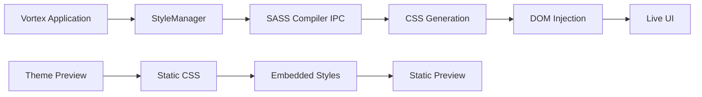

# Theme UI Layout Investigation

## Overview

This document investigates why the main UI packery layout on `theme-preview.html` differs from the actual Vortex application, even though both should be using the SCSS files in `extensions/theme-switcher/themes/macos-tahoe`.

## Architecture

### Vortex Application Theme System

The Vortex application uses a sophisticated theme system that dynamically compiles and applies SCSS files at runtime:

1. **Theme Loading Process**:
   - Themes are loaded through the `theme-switcher` extension
   - SCSS files are resolved and compiled by the `StyleManager` class
   - CSS is injected into the DOM via a `<style id="theme">` element

2. **StyleManager Workflow**:
   ```mermaid
   graph TD
   A[Theme Selection] --> B[setStylesheet API Calls]
   B --> C[StyleManager.setSheet Method]
   C --> D[Queue Render Request]
   D --> E[SASS Compilation via IPC]
   E --> F[CSS Injection into DOM]
   F --> G[UI Update]
   ```

3. **Theme Components**:
   - `variables.scss`: Theme-specific variables
   - `details.scss`: Component styling using variables
   - `fonts.scss`: Font definitions
   - `style.scss`: Custom styling rules

### Theme Preview System

The `theme-preview.html` file serves as a static preview of the theme:

1. **Static Nature**:
   - Contains embedded CSS rather than dynamic SCSS compilation
   - Does not use the Vortex application's StyleManager
   - Does not have access to the actual UI components and layout

2. **Preview Limitations**:
   - Missing JavaScript functionality for dynamic layout (packery)
   - No connection to the Redux state management system
   - No access to actual Vortex UI components

### Packery Layout System

The Vortex application uses the Packery library for dynamic dashboard layout:

1. **Implementation**:
   - Packery is implemented through `PackeryGrid.tsx` and `PackeryItem.tsx` components
   - Uses `packery-item` CSS class for item selection
   - Provides drag-and-drop functionality for dashboard widgets
   - Supports dynamic resizing of widgets

2. **Key Components**:
   - `PackeryGrid`: Main container that initializes Packery
   - `PackeryItem`: Individual dashboard widgets
   - Draggabilly integration for drag functionality
   - Re-resizable integration for resize functionality

3. **CSS Classes**:
   - `.packery-item`: Draggable dashboard items
   - `.packery-height-{n}`: Height classes for different widget sizes
   - `.packery-viewmode`: Non-editable mode
   - `.packery-editmode`: Editable mode with drag handles

## Key Differences

### 1. Runtime Compilation vs Static CSS

| Aspect | Vortex Application | Theme Preview |
|--------|-------------------|---------------|
| SCSS Processing | Dynamic compilation via StyleManager | Pre-compiled static CSS |
| CSS Updates | Real-time updates when files change | Manual updates required |
| Theme Variables | Fully resolved during compilation | May be incomplete or outdated |

### 2. UI Component Availability

The Vortex application has access to all UI components and their associated JavaScript functionality:

- Packery layout engine for dashboard widgets
- Dynamic resizing and positioning
- Event handling for UI interactions
- State management through Redux

The theme preview only provides static HTML representations of UI elements without any of the underlying functionality.

### 3. CSS Injection Mechanism



### 4. Layout Calculation Differences

The packery layout system requires:
- Actual component dimensions
- Container size calculations
- Dynamic positioning based on available space
- Real-time updates when components are added/removed

The theme preview cannot replicate these calculations without the actual JavaScript implementation.

## Root Cause Analysis

The main reason for the layout differences is that **the theme preview does not include the packery layout engine or any of the JavaScript functionality that drives the actual UI layout in the Vortex application**.

The theme preview is designed for:
- Visual styling verification (colors, fonts, spacing)
- Basic layout structure preview
- CSS export functionality

It is NOT designed to:
- Replicate the exact UI layout behavior
- Provide functional UI components
- Simulate the packery layout engine

## Solution Approaches

### Option 1: Update Theme Preview with Packery (Recommended)

Enhance the theme preview to include packery functionality:

1. **Include Packery Library**:
   - Add Packery JavaScript library to theme-preview.html
   - Implement basic Packery initialization
   - Apply proper CSS classes to dashboard items

2. **Core UI Structure**:
   ```
   - MainWindow layout
   - QuickLauncher
   - Banner
   - DynDiv
   - Application icons
   - Version display
   - Dashboard applets (Go Premium, Starter Tools, News)
   - Proper dashlet structure with packery classes
   - macOS traffic light buttons
   ```

3. **JavaScript Implementation**:
   - Initialize Packery on dashboard container
   - Apply proper item classes (.packery-item, .packery-height-{n})
   - Simulate basic drag-and-drop functionality

### Option 2: Build Theme Locally

Ensure the theme is properly built before previewing:

1. **Development Workflow**:
   ```bash
   # Make changes to SCSS files
   # Run the build process to compile SCSS to CSS
   # Update both the generated CSS file and embedded CSS in theme-preview.html
   ```

2. **Automation**:
   - Create a script that automatically updates the embedded CSS when SCSS files change
   - Ensure both the CSS file and embedded styles are synchronized

### Option 3: Use Actual Application for Layout Testing

For accurate layout testing:
- Use the actual Vortex application with the theme applied
- Utilize the theme-switcher extension's real-time preview capabilities
- Test layout changes directly in the application environment

### Option 2: Build Theme Locally

Ensure the theme is properly built before previewing:

1. **Development Workflow**:
   ```bash
   # Make changes to SCSS files
   # Run the build process to compile SCSS to CSS
   # Update both the generated CSS file and embedded CSS in theme-preview.html
   ```

2. **Automation**:
   - Create a script that automatically updates the embedded CSS when SCSS files change
   - Ensure both the CSS file and embedded styles are synchronized

### Option 3: Use Actual Application for Layout Testing

For accurate layout testing:
- Use the actual Vortex application with the theme applied
- Utilize the theme-switcher extension's real-time preview capabilities
- Test layout changes directly in the application environment

## Implementation Plan for Adding Packery to Theme Preview

1. **Add Packery Library**:
   - Include Packery JavaScript library in theme-preview.html
   - Ensure proper initialization of Packery on dashboard container

2. **Apply CSS Classes**:
   - Add proper packery CSS classes to dashboard items
   - Ensure height classes (.packery-height-{n}) are applied correctly
   - Apply viewmode classes (.packery-viewmode)

3. **Initialize Packery**:
   - Add JavaScript code to initialize Packery on page load
   - Configure Packery with proper options (itemSelector, gutter, etc.)
   - Apply layout to dashboard items

4. **Simulate Basic Functionality**:
   - Implement basic drag-and-drop simulation
   - Add resize handles where appropriate
   - Ensure proper positioning of dashboard items

## Recommendations

1. **Update theme-preview.html** to include Packery library and initialization
2. **Apply proper CSS classes** to dashboard items to enable Packery functionality
3. **Synchronize embedded CSS** with the compiled CSS files to ensure styling consistency
4. **Document the limitations** of the theme preview system to set appropriate expectations
5. **Create a more advanced preview system** that includes JavaScript functionality for layout simulation

## Conclusion

The layout differences between `theme-preview.html` and the actual Vortex application stem from the static nature of the preview system versus the dynamic, JavaScript-driven layout system in the actual application. By adding Packery to the theme preview, we can more accurately simulate the dashboard layout behavior and provide a better preview experience for theme developers. The theme preview is primarily designed for visual styling verification, but with the addition of Packery functionality, it can also serve as a more accurate representation of the actual UI layout behavior.