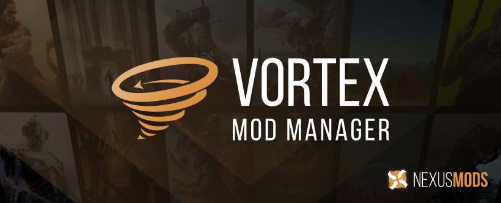

  

  
  
  
  
  
  
  
  
  

  

## Introduction

Vortex is the current mod manager from Nexus Mods. It is designed to make modding your game as simple as possible for new users, while still providing enough control for more experienced veterans of the modding scene.

Our approach with Vortex aims to take complex tasks such as sorting your load order or managing your mod files and automates as much of the process as possible with the goal of having you achieve a stable modded game with minimal effort. We want to help you spend less time modding and more time playing your games.

## Features

* **Multi-game Support** - with mod support for over 250 different games and counting, Vortex is the most versatile mod manager available. This includes games such as [Skyrim](https://www.nexusmods.com/skyrimspecialedition), [Fallout 3](https://www.nexusmods.com/fallout3), [Fallout 4](https://www.nexusmods.com/fallout4), [Fallout: New Vegas](https://www.nexusmods.com/newvegas/), [Cyberpunk 2077](https://www.nexusmods.com/cyberpunk2077/), [Baldur's Gate 3](https://www.nexusmods.com/baldursgate3/), [Starfield](https://www.nexusmods.com/starfield/), [Stardew Valley](https://www.nexusmods.com/stardewvalley/), [Bannerlord](https://www.nexusmods.com/mountandblade2bannerlord), [Witcher 3](https://www.nexusmods.com/witcher3), [Elden Ring](https://www.nexusmods.com/eldenring), [The Sims 4](https://www.nexusmods.com/thesims4), [Monster Hunter: World](https://www.nexusmods.com/monsterhunterworld), [Oblivion](https://www.nexusmods.com/oblivion), [Palworld](https://www.nexusmods.com/palworld), [Blade & Sorcery](https://www.nexusmods.com/bladeandsorcery), [Valheim](https://www.nexusmods.com/valheim), [Hogwarts Legacy](https://www.nexusmods.com/hogwartslegacy/), [7 Days to Die](https://www.nexusmods.com/7daystodie/). 

* **Close integration with Nexus Mods** - Vortex is designed to seamlessly interact with Nexus Mods allowing you to easily find, install, and play mods from our site, learn about new files and catch the latest news.

* **Modding made easy** - The built-in auto-sorting system manages your load order and helps you to resolve mod conflicts with powerful, yet easy to use plugin management features.

* **Mod Profiles** - Easily set up, switch between, and manage independent mod profiles enabling you to use exactly the combination of mods that you want for a particular playthrough.

* **Modern, Easy-to-use UI** - Featuring a fully customisable interface, Vortex allows you to quickly and easily access tools and manage your games, plugins, downloads and save games.

* **Extensions and Plugins** - Vortex is released under a GPL-3 License giving our community the ability to write extensions and frameworks which can then interact with Vortex, continually adding to its functionality.

## Getting Started

To get started, Vortex can be downloaded from [Nexus Mods](https://www.nexusmods.com/site/mods/1?tab=files) or from [GitHub](https://github.com/Nexus-Mods/Vortex/releases/latest). After the installer has been downloaded, just run it and follow the instructions.

Additional information on Vortex and guides can be found in the [Vortex Wiki](https://github.com/Nexus-Mods/Vortex/wiki).

## Development

To start development on Vortex, please use this mostly automated method to download and install all dependencies, clone the [Vortex](https://github.com/Nexus-Mods/Vortex) repo from GitHub and then build it so it can be run from source. Most dependencies are installed using [Scoop](https://scoop.sh).

- Start a powershell by clicking the Start button and typing `powershell`.
- Run `Invoke-WebRequest "https://raw.githubusercontent.com/Nexus-Mods/Vortex/master/bootstrap.ps1" -OutFile bootstrap.ps1` to fetch the bootstrap script
- By default, this script will build Vortex in `C:\build\vortex`. If you wish for it to be located somewhere else, edit the script to change the build directory before running it.
- You will more than likely need to allow scripts to be run. This can be set using `Set-ExecutionPolicy Unrestricted` but a powershell with admin access is required. 
- Run the script (`.\bootstrap.ps1`)

### Decisions

The following section aims to clarify and explain a few development decisions.

#### Development vs Release builds

The toolchain for development builds and release builds is quite different.

In dev builds, the typescript compiler (tsc) is used directly to transliterate each `.ts` file to `.js` individually, electron runs those files directly, dependencies are loaded from `node_modules`.

In release builds we use webpack and ts-loader to bake all `.ts` files and dependencies into two javascript files (one for the main/browser process, one for the renderer). `electron-builder` is used to bundle code & assets, generate an nsis installer, build it into an exe installer and sign them (and all the executables and dlls we ship). There are mulitple electron-builder configuration files for multiple variants, only "oneclick" and "advanced" are used for release builds, the others may be in different states of disrepair (though ci should work as well)

As a result, dev builds are easier to work with and building is much quicker but runtime is slower.

Further, we use a two-package structure, meaning the `/package.json` file is used for all development and the build environment for releases (e.g. this file always controls the electron version being used/bundled) whereas `/app/package.json` decides settings (name, version, dependencies) for the release builds only. We use a custom script (`checkPackages.js`) to ensure that the dependencies for release are a subset of the build `env` dependencies and that they use the same version to avoid problems that didn't occur during testing because of differing dependencies.

Bundled extensions on the other hand are built the same between dev and release: they are always built with webpack and each have their own build setup - with the exception of simple game extensions which are already single js files, those simply get copied over.

#### Yarn 1 vs Yarn 3 vs NPM vs PNPM

This codebase still use yarn 1 (classic). Any attempt to use yarn 2 or 3 ended up with nonsensical errors (missing dependencies that are clearly listed, successive installs leading to missing packages) with no reasonable way to investigate why. npm and pnpm are quite slow in comparison. We don't really use any yarn-specific features (workspaces?) so switching shouldn't be too difficult but for now yarn "classic" works.

#### ESM vs CommonJS

At the time of writing, electron doesn't support ES modules so everything is transpiled to commonjs. This has the consequence that some updated libraries supporting only esm can't be used (e.g. new versions of d3). It also means that asynchronous imports (`const foo = await import('bar')`) are actually synchronous at runtime. Doesn't really matter though since everything is baked into a single file on release builds anyway and code splitting isn't really needed.

#### Reporting Bugs

Please report issues on GitHub and include at the very least the following information:
- The exact version of Vortex you're using
- Your OS
- What you were doing when the bug happened
- What exactly the bug is (crash? error messages? unexpected behaviour?)
- If you get any error message, include the full and exact error message. Do not paraphrase, do not leave out information that looks cryptic or unimportant to you
- The log file (see below)
- Ideally also the application state (see below)

All data the client generates (including settings and logs) are stored at:

| Build Type | Location | Common Path |
| --- | --- | --- |
| Release | `%AppData%\Vortex` | `C:\Users\<USERNAME>\AppData\Roaming\Vortex` |  
| Dev | `%AppData%\vortex_devel` | `C:\Users\<USERNAME>\AppData\Roaming\vortex_devel` |

If you need to report a bug, the following paths inside that directory may be useful in addition to the error message displayed on screen:

- `\vortex.log` (logs are rotated at a certain size, this is the latest one)
- `\state\` except global_account (that one contains keys and passwords so sensitive information)
- `\<game>\state\` (if the bug pertains to a specific game)

### Troubleshooting

TODO: Manual steps with dependencies and versions

## Resources

- [Download Vortex](https://www.nexusmods.com/site/mods/1?tab=files) from Nexus Mods
- [GitHub](https://github.com/Nexus-Mods/Vortex) for source code, issues, and pull requests.
- [Vortex Forum](https://forums.nexusmods.com/index.php?/forum/4306-vortex-support/) or [Discord](https://discord.gg/nexusmods) for support and discussions with the community and the team.
- [Vortex Wiki](https://github.com/Nexus-Mods/Vortex/wiki) for knowledge base, articles and troubleshooting
- [Project Structure](structure.md) for an overview of how the codebase is organized.

## Contributing

The majority of Vortex code is open-source. We are committed to a transparent development process and highly appreciate any contributions. Whether you are helping us fix bugs, proposing new features, improving our documentation or spreading the word - we would love to have you as a part of the Vortex community. 

- Bug Report: If you see an error message or encounter an issue while using Amplication, please create a [bug report](https://github.com/Nexus-Mods/Vortex/issues/new?assignees=&labels=&projects=&template=bug_report.md&title=).

- Feature Request: If you have an idea or if there is a capability that is missing and would make development easier and more robust, please submit a [feature request](https://github.com/Nexus-Mods/Vortex/issues/new?assignees=&labels=&projects=&template=feature_request.md&title=).

- Review Extension: If you're creating a game extension and need us to review it, please submit a [review extension](https://github.com/Nexus-Mods/Vortex/issues/new?assignees=&labels=extension+%3Agear%3A&projects=&template=review-extension.yaml&title=Review%3A+Game+Name) request.

## License

A this project is licensed under the [GPL-3.0](https://github.com/Nexus-Mods/Vortex/blob/master/LICENSE.md) license.
