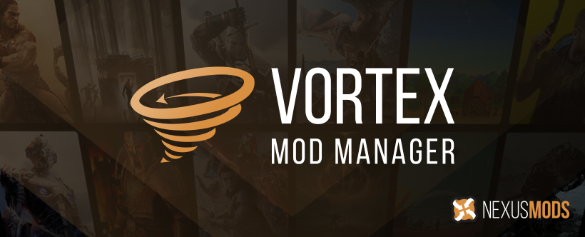

  

  

## Introduction

Vortex is the current mod manager from Nexus Mods. It is designed to make modding your game as simple as possible for new users, while still providing enough control for more experienced veterans of the modding scene.

Our approach with Vortex aims to take complex tasks such as sorting your load order or managing your mod files and automate as much of the process as possible with the goal of having you achieve a stable modded game with minimal effort. We want to help you spend less time modding and more time playing your games.

## Features

* **Multi-game Support** - with mod support for over 250 different games and counting, Vortex is the most versatile mod manager available. This includes games such as [Skyrim](https://www.nexusmods.com/skyrimspecialedition), [Fallout 3](https://www.nexusmods.com/fallout3), [Fallout 4](https://www.nexusmods.com/fallout4), [Fallout: New Vegas](https://www.nexusmods.com/newvegas/), [Cyberpunk 2077](https://www.nexusmods.com/cyberpunk2077/), [Baldur's Gate 3](https://www.nexusmods.com/baldursgate3/), [Starfield](https://www.nexusmods.com/starfield/), [Stardew Valley](https://www.nexusmods.com/stardewvalley/), [Bannerlord](https://www.nexusmods.com/mountandblade2bannerlord), [Witcher 3](https://www.nexusmods.com/witcher3), [Elden Ring](https://www.nexusmods.com/eldenring), [The Sims 4](https://www.nexusmods.com/thesims4), [Monster Hunter: World](https://www.nexusmods.com/monsterhunterworld), [Oblivion](https://www.nexusmods.com/oblivion), [Palworld](https://www.nexusmods.com/palworld), [Blade & Sorcery](https://www.nexusmods.com/bladeandsorcery), [Valheim](https://www.nexusmods.com/valheim), [Hogwarts Legacy](https://www.nexusmods.com/hogwartslegacy/), [7 Days to Die](https://www.nexusmods.com/7daystodie/). 

* **Close integration with Nexus Mods** - Vortex is designed to seamlessly interact with Nexus Mods, allowing you to easily find, install, and play mods from our site, learn about new files and catch the latest news.

* **Modding made easy** - The built-in auto-sorting system manages your load order and helps you to resolve mod conflicts with powerful, yet easy to use plugin management features.

* **Mod Profiles** - Easily set up, switch between, and manage independent mod profiles, enabling you to use exactly the combination of mods that you want for a particular playthrough.

* **Modern, Easy-to-use UI** - Featuring a fully customisable interface, Vortex allows you to quickly and easily access tools and manage your games, plugins, downloads and save games.

* **Extensions and Plugins** - Vortex is released under a GPL-3.0 License, giving our community the ability to write extensions and frameworks which can then interact with Vortex, continually adding to its functionality.

## Getting Started

To get started, Vortex can be downloaded from [Nexus Mods](https://www.nexusmods.com/site/mods/1?tab=files) or from [GitHub](https://github.com/Nexus-Mods/Vortex/releases/latest). After the installer has been downloaded, just run it and follow the instructions.

Additional information on Vortex and guides can be found in the [Vortex Wiki](https://github.com/Nexus-Mods/Vortex/wiki).

## Resources

- [Download Vortex](https://www.nexusmods.com/site/mods/1?tab=files) from Nexus Mods
- [GitHub](https://github.com/Nexus-Mods/Vortex) for source code, issues, and pull requests.
- [Vortex Forum](https://forums.nexusmods.com/index.php?/forum/4306-vortex-support/) or [Discord](https://discord.gg/nexusmods) for support and discussions with the community and the team.
- [Vortex Wiki](https://github.com/Nexus-Mods/Vortex/wiki) for knowledge base, articles and troubleshooting

## Contributing

The majority of Vortex code is open-source. We are committed to a transparent development process and highly appreciate any contributions. Whether you are helping us fix bugs, proposing new features, improving our documentation or spreading the word - we would love to have you as a part of the Vortex community.

- Bug Report: If you see an error message or encounter an issue while using our application, please create a [bug report](https://github.com/Nexus-Mods/Vortex/issues/new?assignees=&labels=&projects=&template=bug_report.md&title=).
- Feature Request: If you have an idea or if there is a capability that is missing and would make development easier and more robust, please submit a [feature request](https://github.com/Nexus-Mods/Vortex/issues/new?assignees=&labels=&projects=&template=feature_request.md&title=).
- Review Extension: If you're creating a game extension and need us to review it, please submit a [review extension](https://github.com/Nexus-Mods/Vortex/issues/new?assignees=&labels=extension+%3Agear%3A&projects=&template=review-extension.yaml&title=Review%3A+Game+Name) request.

## License

This project is licensed under the [GPL-3.0](https://github.com/Nexus-Mods/Vortex/blob/master/LICENSE.md) license.
