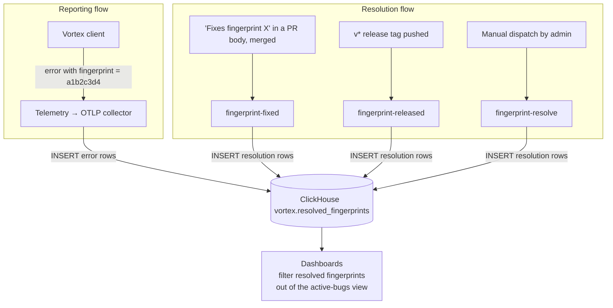

# Fingerprint Resolution Tracking

Vortex telemetry tags every reported error with a short fingerprint of its stack trace. Identical bugs share the same fingerprint, so the dashboard groups them — one row `a1b2c3d4 — 50 occurrences` instead of fifty separate copies of the same crash.

**What goes wrong without this:** the dashboard fills up with errors that are already fixed. A bug you shipped a fix for weeks ago keeps appearing next to whatever broke today, and real new bugs hide in the noise.

**What these workflows do:** when a developer fixes a bug, the workflow writes its fingerprint into `vortex.resolved_fingerprints` with a status — `fixed` (a fix is merged but not shipped yet), `released` (the fix is in a version users can install), or `ignored` (the fingerprint represents something we've decided isn't a real bug). The dashboard reads that table and hides resolved or ignored fingerprints, so the list only shows bugs that are actually still broken.

## The flow



## Status lifecycle

| Status     | Meaning                                                                                                                                                                                                |
| ---------- | ------------------------------------------------------------------------------------------------------------------------------------------------------------------------------------------------------ |
| `fixed`    | A PR resolving the error has merged but the fix has not yet shipped — affected users on a released build will still see it.                                                                            |
| `released` | The fix has landed in a tagged release (`v*`); users on that version or later should not encounter it.                                                                                                 |
| `ignored`  | The fingerprint is being suppressed on purpose — false positive, expected error in some user environments, third-party failure outside our control, etc. No fix, no `release_version`, terminal state. |

`released` and `ignored` are "fully resolved" gates (don't show at all) and `fixed` is a softer signal ("a fix is queued for the next release"). `ignored` is set only via `mode: resolve` (manual workflow dispatch) — there's no automatic path that produces it.

## How developers feed it

Add a `Fixes fingerprint <hex>` line anywhere in the PR body. Accepted forms (the prefix is case-insensitive and uppercase hex is normalized to lowercase):

```
Fixes fingerprint a1b2c3d4
Fixes fingerprints a1b2c3d4, b5c6d7e8, c9d0e1f2
Fixes fingerprints a1b2c3d4 b5c6d7e8
fixes fingerprint A1B2C3D4         ← prefix case-insensitive, hex normalized to lowercase
```

The `^Fixes fingerprints?` regex requires the line to _start_ with the verb (no leading text), and only matches whole 8-hex-char tokens via `\b` word boundaries. Uppercase hex captures get `.toLowerCase()`d before they hit ClickHouse, so the table only ever holds canonical lowercase values.

## Workflows

All three live in [.github/workflows](../../.github/workflows/) and invoke the same composite action ([.github/actions/fingerprints](../../.github/actions/fingerprints/)) with a different `mode`.

### `fingerprint-fixed.yml` — `mode: pr`

- Trigger: `pull_request: closed`, scoped to `branches: [master, "v*"]`, gated on `github.event.pull_request.merged == true`.
- Skips auto-cherry-pick PRs by checking `head.ref` does not start with `cherry-pick/` (the prefix [.github/scripts/cherry-pick.sh](../../.github/scripts/cherry-pick.sh) hardcodes for the branches it pushes). The original PR records the fix; the cherry-pick is just propagation.
- The action reads `github.event.pull_request.body`, extracts every `Fixes fingerprint <hex>` line, and inserts one row per fingerprint with `status: fixed` and `release_version: ""`.

### `fingerprint-released.yml` — `mode: release`

- Trigger: `push: tags: ["v*"]`.
- Resolves the previous `v*` tag, paginates closed PRs sorted by `updated_at` desc, and stops when `updated_at < since` (using the invariant `merged_at <= updated_at`).
- For each merged PR with `Fixes fingerprint` lines in its body, inserts a row with `status: released` and `release_version: <current tag>`.
- `concurrency: fingerprint-released-${{ github.ref }}` so two near-simultaneous tag pushes can't race.

### `fingerprint-resolve.yml` — `mode: resolve`

- Trigger: `workflow_dispatch` (manual; restricted to users with write access).
- Inputs:
    - `fingerprints` — comma- or whitespace-separated list of 8-hex-char fingerprints
    - `remove` — boolean; when `true`, deletes the rows instead of inserting
    - `status` — `fixed`, `released`, or `ignored` (when adding)
    - `release_version` — required when `status=released` and `remove=false`
- Use cases: backfilling fingerprints that pre-date the workflow, correcting a typo, removing a row that was misclassified.

## The action

Source layout — [.github/actions/fingerprints/](../../.github/actions/fingerprints/):

```
src/
  index.ts            entry: validates `mode`, dispatches, applies result
  types.ts            Status / Mode const-objects with per-member JSDoc + type guards
  collect-pr.ts       extracts fingerprints from current PR body
  collect-release.ts  walks merged PRs since previous v* tag (early-stop pattern)
  collect-input.ts    validates manual workflow_dispatch inputs
  clickhouse.ts       batched JSONEachRow insert + parameterized DELETE
  *.test.ts           vitest unit tests (mocked octokit / @clickhouse/client)
dist/index.js         bundled by @vercel/ncc, committed for runtime
```

- Self-contained pnpm setup (own `pnpm-workspace.yaml`) so the action stays isolated from the root Vortex workspace.
- Uses the official [`@clickhouse/client`](https://www.npmjs.com/package/@clickhouse/client). DELETE is parameterized via `query_params` (`Array(String)` binding) — no string interpolation into SQL.
- Fingerprint format (`^[a-f0-9]{8}$/i`) is validated at every layer: input parsing, action entry, and pre-query.

### Edit + rebuild loop

```bash
cd .github/actions/fingerprints
pnpm install
pnpm test
pnpm run build
```

Commit both source changes _and_ the rebuilt `dist/index.js` — GitHub Actions runs `dist/index.js` directly and never installs dependencies or runs any build step in CI.

## Reference

### ClickHouse table

```
vortex.resolved_fingerprints
```

Columns the action writes (the table itself is provisioned out-of-band):

| Column            | Type       | Source                                                                           |
| ----------------- | ---------- | -------------------------------------------------------------------------------- |
| `fingerprint`     | `String`   | The 8-char hex captured from the PR body (always lowercase).                     |
| `pr_url`          | `String`   | PR URL for `mode: pr` and `mode: release`; workflow run URL for `mode: resolve`. |
| `updated_at`      | `DateTime` | When the action wrote the row (action-side timestamp, `YYYY-MM-DD HH:MM:SS`).    |
| `updated_by`      | `String`   | PR author (or `context.actor` for manual resolve).                               |
| `release_version` | `String`   | Tag name (e.g. `v2.0.1`) for `released`; empty otherwise.                        |
| `status`          | `String`   | `fixed` or `released`.                                                           |

DELETE uses ClickHouse's lightweight delete syntax (`DELETE FROM ... WHERE ... IN ({fps: Array(String)})`) which requires **ClickHouse 23.3+**.

### Required secrets

Set these on the repo (Settings → Secrets and variables → Actions):

- `CLICKHOUSE_URL` — HTTP endpoint, including `https://` and port (`8443` for ClickHouse Cloud TLS)
- `CLICKHOUSE_USER`
- `CLICKHOUSE_PASSWORD`

The user's permission scope on ClickHouse should be limited to `INSERT`/`DELETE` on the single `vortex.resolved_fingerprints` table.
