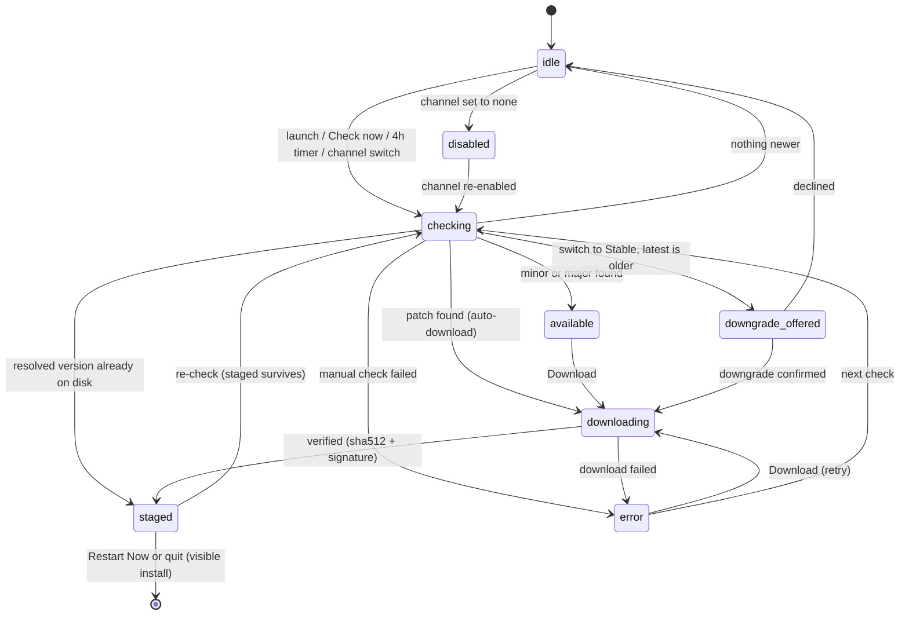

# The Auto-Updater

How Vortex decides that an update exists, what it does about it, and what the
user sees at every step. For local testing of any of this, see
[updater-testing.md](./updater-testing.md) and, for the signed end-to-end run
against real GitHub, [updater-rehearsal.md](./updater-rehearsal.md); for how
releases get published,
see [publishing-releases.md](./publishing-releases.md).

## How an update is found

Vortex resolves releases itself instead of trusting electron-updater's GitHub
provider (which picks the newest by publish date, the root cause of the old
"offers a downgrade that's really an upgrade" bug). The resolver
(`src/main/src/extensions/autoupdater/releaseResolver.ts`) queries the GitHub
releases API and picks the highest eligible semver for the channel:

- **Stable**: highest non-prerelease. Releases whose prerelease flag and
  version suffix disagree are excluded as mispublished.
- **Beta / next**: highest overall. A newer stable beats an older beta, so
  beta users aren't left behind on stable hotfixes.
- Drafts, non-semver tags, and releases missing their installer or
  `latest.yml` are never eligible.

electron-updater is then pointed at that one release via a generic feed. Its
job reduces to downloading (differential, via blockmaps; a patch typically
transfers about 10% of the installer), verifying the sha512 and the
Authenticode signature (`publisherName` from the packaged `app-update.yml`),
and running the installer.

## What happens for each kind of update

| Kind              | Example                                                       | Download                         | User sees                                                                                                                                                                                                    |
| ----------------- | ------------------------------------------------------------- | -------------------------------- | ------------------------------------------------------------------------------------------------------------------------------------------------------------------------------------------------------------ |
| **Patch**         | 2.6.0 → 2.6.1                                                 | automatic, silent                | Nothing until staged, then "Vortex will update on restart" with [Restart Now]. Installs on quit or on the button.                                                                                            |
| **Minor / major** | 2.6.x → 2.7.0                                                 | waits for the user               | "Vortex {v} is available to download" with [What's New] [Download]; while downloading, "Downloading Vortex {v} (p%)" with no buttons; then "Vortex {v} is ready to install" with [What's New] [Restart Now]. |
| **Downgrade**     | on stable channel, running a version newer than stable-latest | only after explicit confirmation | See below.                                                                                                                                                                                                   |

Two rules govern all the feedback:

1. Background work is silent unless it changes something the user can see.
   Launch, periodic (4-hourly), and channel-sync checks never toast; an
   offline background check fails into the log only.
2. Button-pressed work is visible from the press until it settles. A manual
   Check now shows "Checking..." (on the button and as a notification) and
   always answers: the update re-shows, an "up to date" toast, or an error.
   A download the user set in motion (Download, a downgrade confirm, or a
   manual check that found a patch) shows live progress.

## Downgrades

A lower version is never presented as an update. The only flow that offers
one is the user purposefully switching the update channel to Stable while
running something newer (e.g. leaving beta). Then:

- "Vortex {v} is a downgrade and older than your current version" appears,
  with a [More] button that opens a dialog spelling out the risk.
- **Stay on current version** clears the offer; only another purposeful
  switch to Stable raises it again.
- **Downgrade to {v}** downloads (visible, with progress) and stages it:
  "Vortex will update on restart". Nothing installs without the user
  restarting or quitting. A one-shot marker suppresses the "Downgrade
  detected" startup warning for the version the user knowingly chose.
  Unexpected downgrades still warn.

## Installing

Installs always run the visible NSIS wizard (auto-update mode: no choices,
straight to install, finish page relaunches Vortex), never a silent
background install. Vortex is a per-machine install, so Windows shows a UAC
prompt first. The same visible install runs whether the user clicks Restart
Now or simply quits Vortex with an update staged. A staged installer is only
run for the version currently on offer, never a stale one.

On the first launch after an update, "Vortex was updated to {v}" appears with
a [View changes] button showing the release notes for every version the
update spanned.

## Failures

- A failed download raises "Vortex update failed" (details behind [More]) and
  returns the update to a downloadable state so the user can retry. A patch
  whose automatic download failed is not retried automatically for 15
  minutes; it is offered like a regular update instead.
- A failed manual check says so; it never reads as "up to date".
- A failed background check (offline is normal) logs and changes nothing.
- Cancelling a download by switching channels is not an error.

## The state machine

The updater is a single explicit state machine (`UpdaterState` in
`src/shared/src/types/ipc.ts`, modeled on VS Code's updater): one state at a
time, every transition logged to `vortex.log` as `Updater state {from, to}`,
and the renderer's notifications are a pure function of the current state
(`src/renderer/src/extensions/updater/index.ts`).

Setting the channel to none withdraws anything on offer and disables checks
entirely (with a warning in Settings that old versions eventually lose
network features).

## Channels

`settings.update.channel`: `stable` (default), `beta`, `none`, plus a hidden
`next` used by preview builds (`IS_PREVIEW_BUILD=true` reads releases from
`Vortex-Staging` instead of `Vortex`; the channel itself never changes the
repo). Manual checks are rate-limited to once per minute in the Settings UI.
