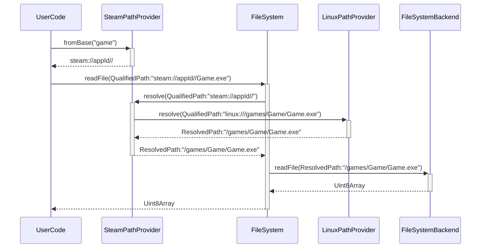

# `@vortex/fs`

Filesystem and paths abstraction for Vortex.

## Concepts

- `PathProvider`: Creates a `QualifiedPath` from a "base".
- `QualifiedPath`: Class representing a fully qualified path based on a scheme, data, and a path: `scheme://data//path`.
- `FileSystem`: Filesystem abstraction using `QualifiedPath` for inputs and outputs, fully async.
- `FileSystemBackend`: Same APIs as `FileSystem` but using `ResolvedPath` for inputs and outputs.
- `PathResolver`: Turns `QualifiedPath` into `ResolvedPath`, can be constructed hierarchical with a `parent` resolver property.
- `ResolvedPath`: Opaque string representing a raw platform path.

This sequence diagram showcases an iteraction from user code:

Note the use of `SteamPathProvider` which creates a `QualifiedPath` of value `steam://appId//` when asked for the game path. The `data` part of a `QualifiedPath` allows us to encode context into the path itself. When the user code calls `gamePath.join("Game.exe")` on the path it will get `steam://appId//Game.exe`. Passing this path to the `FileSystem` API requires the implementation to resolve `steam://appId//Game.exe` before passing it to the `FileSystemBackend` implementation. The `FileSystem` implementation has to have a list of registered resolvers mapped by `QualifiedPath.scheme` in order to resolve the path.

Since path providers can be chained, the `SteamPathProvider` will take `steam://appId//Game.exe`, replace the `steam://appId//` part with the actual path of the game `linux:///games/Game` and call its parent resolver to handle `linux:///games/Game.exe`.
