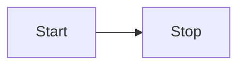

App

app_launched { is_legacy_ui } // true = legacy/classic UI, false = modern
app_ui_mode_changed { is_legacy_ui } // the mode switched to, from Settings > Theme

Toolbar

toolbar_action_clicked { toolbar, action, extension, surface } // mods page only for now
toolbar_pin_changed { toolbar, action, extension, pinned } // pinned = the state moved to
toolbar_pins_reset { toolbar } // the whole toolbar back to defaults, so no action
// action = the same stable id pinning stores against, never the translated label
// extension = absent for an action the page owns rather than one registered into it
// surface = bar | overflow | menu (reached directly, via the kebab, or inside Open.../Import...)
// where pinning is on the kebab holds every action, so `overflow` means "reached through
// the menu" rather than "did not fit" — and a menu interaction reports twice, the Open...
// parent on `bar` and then the row on `menu`

Mods

mods_download_started
mods_download_completed
mods_download_failed
mods_download_cancelled

mods_installation_started
mods_installation_completed
mods_installation_failed
mods_installation_cancelled

Collections

collections_download_started { collection_id, revision_id, game_id, mod_count } // server side
collections_download_completed { collection_id, revision_id, game_id, file_size, duration_ms }
collections_download_failed { collection_id, revision_id, game_id, error_code, error_message };
collections_download_cancelled { collection_id, revision_id, game_id }

collections_installation_started { collection_id, game_id, revision_id, mod_count }
collections_installation_completed { collection_id, revision_id, game_id, mod_count, duration_ms }
collections_installation_failed { collection_id, revision_id, error_code, error_message, game_id, }
collections_installation_cancelled { collection_id, revision_id, game_id }
