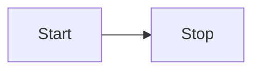

App

app_launched { is_legacy_ui } // true = legacy/classic UI, false = modern
app_ui_mode_changed { is_legacy_ui } // the mode switched to, from Settings > Theme

Toolbar

app_toolbar_action_clicked { toolbar, action, extension, surface } // mods page only for now
app_toolbar_pin_changed { toolbar, action, extension, pinned } // pinned = the state moved to
app_toolbar_pins_reset { toolbar } // the whole toolbar back to defaults, so no action
// action = the same stable id pinning stores against, never the translated label
// extension = absent for an action the page owns rather than one registered into it
// surface = bar | overflow | menu (reached directly, via the kebab, or inside Open.../Import...)
// where pinning is on the kebab holds every action, so `overflow` means "reached through
// the menu" rather than "did not fit" — and a menu interaction reports twice, the Open...
// parent on `bar` and then the row on `menu`

Table

app_table_columns_viewed { table, visible_columns, hidden_columns, visible_column_count } // once per table per game per session
app_table_column_toggled { table, column, visible } // visible = the state moved to
// table = mods | downloads | extensions | collection-mods-edit | collection-mods-view |
// collection-add-mods
// usually the id the table stores its layout against, except where two tables share one:
// authoring a collection and viewing one are both `collection-mods` for layout but are
// different sets of columns, so they report under their own ids and neither is dropped
// column ids are the attribute ids that layout is stored against, never the translated header
// visible_columns = on show, in the order drawn; hidden_columns = offered by the toggle menu but off
// a column in neither list was never offered here: no extension provides it, or its own
// condition said no. Attributes that can't be a column (details pane, inline) are left out
// of both, and toggling one is not an event
// once per game a session, so the answer stays per install however often the page is
// opened — and a user who switches game reports again rather than leaving their only
// snapshot stamped with whichever game they opened first. game_id comes from the super
// property, so it isn't in the event's own fields
// game extensions contribute columns, so the same table is a different set of columns
// from one game to the next, which is what makes the per-game breakdown worth having

Mods

mods_download_started
mods_download_completed
mods_download_failed
mods_download_cancelled

mods_installation_started
mods_installation_completed
mods_installation_failed
mods_installation_cancelled

Collections

collections_download_started { collection_id, revision_id, game_id, mod_count } // server side
collections_download_completed { collection_id, revision_id, game_id, file_size, duration_ms }
collections_download_failed { collection_id, revision_id, game_id, error_code, error_message };
collections_download_cancelled { collection_id, revision_id, game_id }

collections_installation_started { collection_id, game_id, revision_id, mod_count }
collections_installation_completed { collection_id, revision_id, game_id, mod_count, duration_ms }
collections_installation_failed { collection_id, revision_id, error_code, error_message, game_id, }
collections_installation_cancelled { collection_id, revision_id, game_id }
